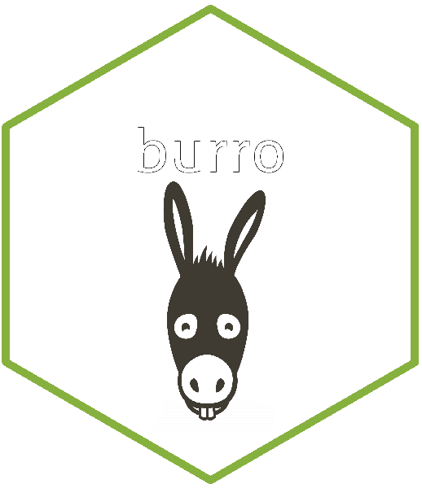

# `burro`: A Shiny Data Explorer for Teaching Exploratory Data Analysis



## Why `burro`(w) into your data?

Exploratory Data Analysis (EDA) is highly visual and can be a motivating entry point into data science and the analysis of the data. `burro` attempts to make EDA accessible to a larger audience by exposing datasets as a simple Shiny App that can be shared via `shinyapps.io` or other Shiny hosts. 

We use `burro` as an introductory tool for EDA by using it in "data scavenger hunts", where groups of students are given specific questions to answer about the data, and then have to show their fellow students the answer and how the discovered it.

By concentrating on the data visualzation rather than the coding, `burro` lets us have conversations about the data first, and hopefully motivate the students to learn more tools of EDA such as `ggplot`, `visdat`, and `skimr`.

## Installing `burro`

```{r}
devtools::install_github("laderast/burro")
```

## Dataset requirements

`burro` expects a dataset as a `data.frame` or `data.table`. The dataset should have at least 2 numeric variables and two categorical variables. 


`burro` requires an *outcome variable*, which should be categorical/factor.
It's on my list of things to do to make `burro` adaptive to the data passed into it, but it currently is pretty inflexible about these two things. 

## Running `burro` on `NHANES` Data

You can see the `burro` app for the `NHANES` data here: https://tladeras.shinyapps.io/nhanes_explore/

```
library(burro)
data(NHANES)

##specify outcome variable here
outcome_var <- c("Depressed")
## specify covariates here (including outcome variable)
covariates <- c("Gender", "Age", "SurveyYr", "Race1", "Race3" ,"MaritalStatus",
                "BMI", "HHIncome", "Education",
                "BMI_WHO", "BPSysAve", "TotChol", "Depressed", "LittleInterest",
                "SleepHrsNight", "SleepTrouble", "TVHrsDay", "AlcoholDay",
                "Marijuana", "RegularMarij", "HardDrugs")
                
explore_data(NHANES, covariates, outcome_var)
```
## Acknowledgements

`burro` uses many wonderful packages developed by Nicholas Tierney, rOpenSci, and others: `visdat`, `naniar`, and `skimr`, among others. 

`burro` was partially developed with funding from Big Data to Knowledge (BD2K) and the National Library of Medicine T15 Training Grant supplement.

`burro` hex sticker uses clipart [https://www.freepik.com/free-vector/donkey-head_763369.htm](Designed by Freepik).

## Related Packages

The `esquisse` package (https://github.com/dreamRs/esquisse) is a wonderful start to making a drag and drop visualization tool in R. Check it out!

## License

`burro` is released under an Apache 2.0 licenase.
