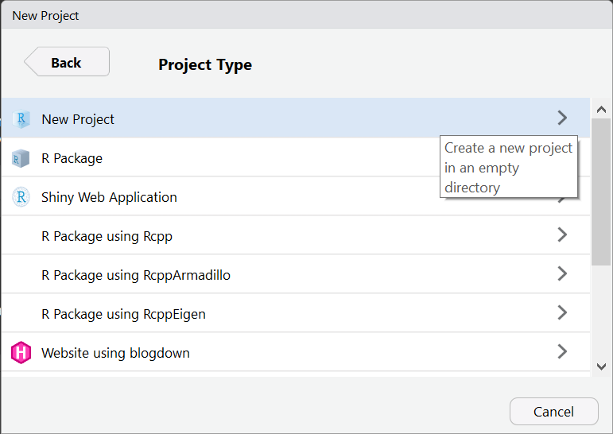
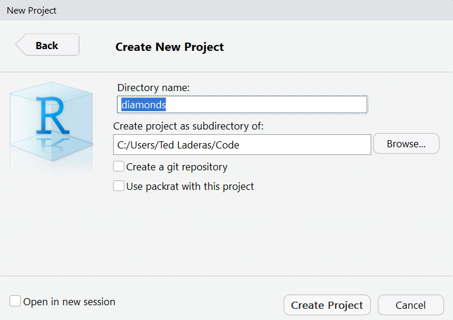

```{r setup, include=FALSE}
knitr::opts_chunk$set(echo = TRUE)
```

## Note

There is currently an issue with `visdat` and the Shiny app when deployed. The app is not showing the `visdat  summary when given a very large dataset. This apparently has to with the memory available on the Shiny server. For this reason, try to subset the data in the app to be around 10,000 rows or less, unless you have more memory.

## Let's make an app!

Excited to make an app to explore data together? You've come to the right place. 

`burro` has a function called `build_shiny_app` that will do most of the building for you. Let's run through that process. Here's the steps required to build an app.

## Steps in Making a `burro` App

1. Make a new project
1. Load your Data (and data dictionary in)
1. Choose your Covariates
1. Choose your outcome variable
1. Build App
1. Deploy to `shinyapps.io`. 


## 1. Make a New Project

In RStudio, make a new project by going to **File >> New Project** and Choose the "New Folder" option. 




```{r}
library(burro)
library(readxl)
```

Name the folder what you want your app to be named. Let's name our project "diamonds". 




## 2. Load in Your Data (and data dictionary)

We're going to use the `diamonds` dataset from the `ggplot2` package. In the console, type the following:

```{r}
library(ggplot2)
data(diamonds)
head(diamonds)
```

## 3. Choose your variables

Your dataset may have variables (or covariates) that you might want to remove from the app. Here's your chance to whittle them down, by selecting the covariates that you want to include. 

Here are all of the variables in the `diamonds` dataset. 

```{r}
colnames(diamonds)
```

We're going to specify our variables as 

```{r}
covars <- c("carat", "cut", "color", "clarity", "depth", "table", "price")
```

## 4. Choose your outcome variable

You'll now need to choose your *outcome variable*, which currently needs to be a `factor` (categorical) variable. A number of visualizations in `burro` are in terms of this outcome. 

We're going to focus on the `cut` type of the diamond as our outcome.

```{r}
outcome <- "cut"
```

## 5. Build your app!

With everything specified, we can now build our app in our current project. `diamonds` is a fairly large dataset (over 50,000 rows) and we need to filter it down with the `dplyr` command `sample_n`, to limit it to 10,000 rows. This ensures that the `burro` app will run on limited memory servers such as the ones available to default `shinyapps.io` accounts.

```{r eval = FALSE}
diamonds <- diamonds %>% dplyr::sample_n(10000)
build_shiny_app(dataset = diamonds, covariates=covars, outcome_var=outcome)
```

Check to make sure that there's an `app.R` in your main project folder and there is a `dataset.rds` file in your `data` folder inside your project.

Open the `app.R` file and hit the `Run App` button. Your app should pop up. Try it out!

## 6. Deploy to `shinyapps.io`

Your `burro` project is now ready to be deployed to a Shiny Server! We'll focus on [Shinyapps.io](http://shinyapps.io) because it's free. You'll need to follow the directions here: https://docs.rstudio.com/shinyapps.io/getting-started.html (signing up, installing the `rsconnect` package, setting it up) to get started. 

Once all that is setup, you can hit the "Publish" button or use `rsconnect::deployApp()` to publish it to your `Shinyapps.io` account. 

## 7. Send your URL out and have a data scavenger hunt!

Your `burro` app is now ready to share at your url. Send it out and have a [data scavenger hunt]()!


